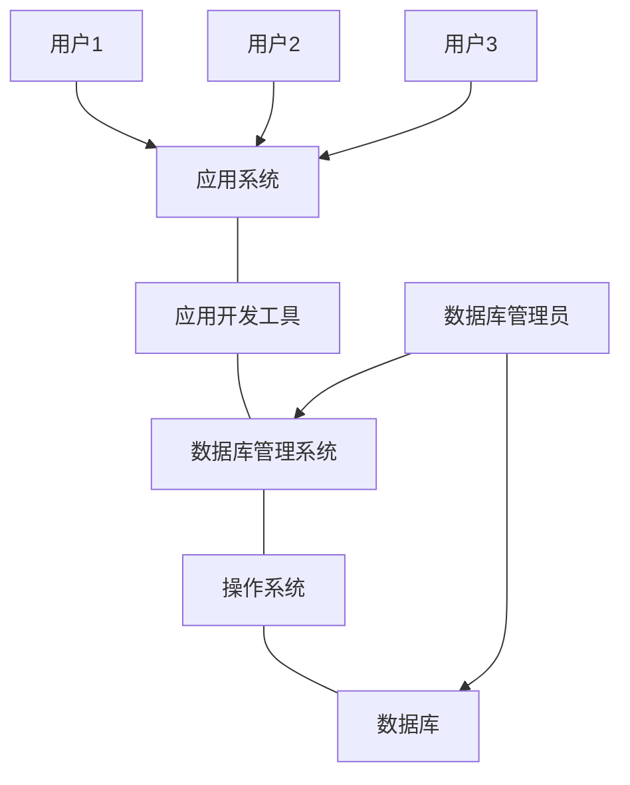

# 第一章·绪论
> 乔毅
> 学号：2019210472
> 1.数据库系统的基本概念  
> 2.数据管理技术的发展过程  
> 3.数据库系统的组成部分  

[TOC]

## 1.1 数据库系统概述

> 数据库最基本的术语和基本概念

### 1.1.1 数据库的4个基本概念
- 1.数据（data）
  - 数据是数据库中存储的基本对象  
    *数据的种类很多，不限于数字*
  - **描述事物的符号记录称为数据** 
  - 数据的含义称为数据的语义  
    数据与其语义是不可分的
  
- 2.数据库（Database，DB）
  
  - 数据库是存放数据的仓库，且数据按照一定格式存放
  - 数据库是**长期储存在计算机内、有组织的、可共享的大量数据的集合**，  
    数据库中的数据你找一定的**数据模型**组织、描述和储存，  
    具有较小的亢余度（redundancy）、较高的数据独立性（data independency）和易扩展性（scalability），并可为各种用户共享
  - 数据库数据具有**永久储存**、**有组织**和**可共享**三个基本特点
  
- 3.数据库管理系统（Database Management System，DBMS）
  
  - 数据库管理系统是位于用户和操作系统之间的一层数据管理**软件**，主要功能包括
    - 数据定义功能——数据定义语言（Data Definition Language，DDL）
    - 数据组织、存储和管理——实现数据之间的联系
    - 数据操纵功能——数据操纵语言（Data Manipulation Language，DML）
    - 数据库的事务管理和运行管理
    - 数据库的建立和维护
    - 其他功能
  
- 4.数据库系统（Data Base System，DBS）

  - 数据库系统是由数据库、数据库管理系统（及其应用开发工具）、应用程序和数据库管理员（Database Administrator，DBA）组成的**存储、管理、处理和维护数据的系统**。

  - 数据库的管理不仅靠数据库管理系统，还要有专门的人员→数据库管理员

### 1.1.2 数据管理技术的产生和发展
- 1.人工管理阶段——20世纪50年代中期
	- 数据不保存
	- 应用程序管理数据
	- 数据不共享
	- 数据不具有独立性
- 2.文件系统阶段——20世纪50年代后期到60年代中期
	- 数据可以长期保存
	- 由文件系统管理数据
	- 数据共享性差，亢余度大
	- 数据独立性差
- 3.数据库系统阶段——20世纪60年代后期以来
	- 硬件有大容量磁盘，硬件价格下降，软件价格上升
	- **从文件系统到数据库系统标志着数据管理技术的飞跃**

### 1.1.3 数据库系统的特点
- 1.数据结构化
	- 数据库系统实现整体数据的结构化，是**数据库的主要特征之一**，也是数据库系统与文件系统的本质区别
	- 数据库中的数据是面向整个组织或企业
	- 不仅数据内部是结构化的，而且整体是结构化的，数据之间是具有联系的
- 2.数据的共享性高、亢余度低且易扩充
	- 数据共享可以大大减少数据亢余，节约存储空间
	- 避免数据之间的不相容性与不一致性
	- 数据库系统弹性大，易于补充
- 3.数据独立性高
	- 包括数据的**物理独立性**和**逻辑独立性**
	- 物理独立性是指用户的应用程序与数据库中数据的物理存储是相互独立的
	- 逻辑独立性是指用户的应用程序与数据库的逻辑结构是相互独立的
- 4.数据由数据库管理系统统一管理和控制
	- 数据的安全性（security）保护：保护数据以防止不合法使用造成的数据泄密和破坏
	- 数据的完整性（integrity）检查：数据的正确性、有效性和相容性
	- 并发（concurrency）控制：对多用户的并发操作加以控制和协调
	- 数据库恢复（recovery）：数据库管理系统必须有将数据库从错误状态恢复到某一已知的正确状态的功能

## 1.2 数据模型
> 数据模型（data model）也是一种模型，是对现实世界数据特征的抽象
> 数据模型时数据库系统的核心和基础 

### 1.2.1 两类数据模型
- 第一类是**概念模型**，第二类是**逻辑模型和物理模型**
	- 概念模型（conceptual model）是按照用户的观点来对数据和信息建模，主要用于数据库设计
	- 逻辑模型是按照计算机系统的观点对数据建模，主要用于数据库系统的实现→对数据最底层的抽象
- 首先将现实世界抽象为信息世界，然后将信息世界转换为机器世界
### 1.2.2 概念模型
概念模型实际上是现实世界到机器世界的一个中间层次  
- 1.信息世界中的基本概念
	- 实体（entity）：客观存在并可互相区别的事物称为实体
	- 属性（attribute）：实体所具有的某一特性成为属性
	- 码（key）：唯一标识实体的属性成为码
	- 实体型（entity type）：用实体名及其属性名集合来抽象和刻画同类实体
	- 实体集（entity set）：同一类型实体的集合称为实体集
	- 联系（relationship）：实体内部和实体之间的联系，有一对一、一对多和多对多等多种类型
- 2.概念模型的一种表示方法：实体-联系方法
	- 实体-联系方法（Entity-Relationship approach）
	- 用E-R图（E-R diagram）来描述现实世界的概念模型
### 1.2.3 数据模型的组成要素
数据模型通常由数据结构、数据操作和数据的完整性约束条件三部分组成
- 1.数据结构：描述数据库的组成对象以及对象之间的联系。
- 2.数据操作：对数据库中的各种对象（型）的实例（值）允许执行的操作的集合，包括操作及有关的操作规则
- 3.数据的完整性约束条件：是一组完整性规则，以保证数据的正确、有效和相容
### 1.2.4 常用的数据模型
- 数据库领域中主要的逻辑数据模型有
	- 层次模型（hierarchical model）
	- 网状模型（network model）
	- 关系模型（relational model）
	- 面向对象数据模型（object oriented data model）
	- 对象关系数据模型（object relational data model）
	- 半结构化数据模型（semistructure data module）
- 在格式化模型中数据结构的单位是基本层次联系，是指两个记录以及他们之间的一对多（包括一对一）的联系→双亲结点（parent）和子女结点（child）
### 1.2.5 层次模型
层次模型是数据库系统中最早出现的数据模型  
- 1.层次模型的数据结构
	- 在数据库中定义满足下面两个条件的基本层次联系的集合为层次模型
		- 有且只有一个结点没有双亲结点，这个结点称为根结点
		- 根以外的其他结点有且只有一个双亲结点
	- 每一个结点表示一个记录类型，记录类型之间的联系同结点之间的连线（有向边）表示，这种联系是父子之间的一对多的联系
	- 层次模型像一棵倒立的树，结点的双亲是唯一的
- 2.层次模型的数据操纵与完整性约束
	- 层次模型的数据操纵主要用查询、插入、删除和更新
	- 要满足层次模型的完整性约束条件
- 3.层次模型的优缺点
	- 层次模型的优点主要有
		- 层次模型的数据结构比较简单清晰
		- 层次数据库的查询效率高
		- 层次数据模型提供了良好的完整性支持
	- 层次模型的缺点主要有
		- 现实世界中很多联系是非层次的
		- 如果一个结点具有多个双亲结点，用层次模型表示就十分笨拙
		- 查询子女结点必须通过双亲结点
		- 由于结构严密，层次命令趋于程序化
### 1.2.6 网状模型
现实世界中事物之间的联系更多是非层次关系的，网状模型可以克服层次关系表示非树形结构的弊病  
- 1.网状模型的数据结构
	- 在数据库中，把满足以下两个条件的基本层次联系集合称为网状模型
		- 允许一个以上的结点无双亲
		- 一个结点可以有多于一个的双亲
	- 网状模型是一种比层次模型更加普遍的结构
	- 层次模型中子女结点与双亲结点的联系是唯一的，而在网状模型中这种联系可以不唯一
- 2.网状模型的数据操纵与完整性约束
	- 网状模型一般来说没有层次模型那样严格的完整性约束条件
	- 具体的网状数据库系统对数据操纵都加了一些限制并提供了一定的完整性约束
- 3.网状模型的优缺点
	- 网状模型的优点主要有
		- 能够更为直接的描述现实世界
		- 具有良好的性能，存取效率更高
	- 网状模型的缺点主要有
		- 结构比较复杂
		- 网状模型的DDL、DML复杂，且要嵌入某一种高级语言中
		- 记录之间的联系是通过存取路径实现的，访问数据时加重了编写应用程序的负担
### 1.2.7 **关系模型**
**关系模型是最重要的一种数据模型**  
- 1.关系模型的数据结构
	- 关系模型是建立在严格的数学概念的基础上的
	- 关系模型由一组关系组成，每个关系的数据结构是一张规范化的二维表
		- 关系（relation）：一个关系对应通常说的一张表
		- 元组（tuple）：表中的一行即为一个元组
		- 属性（attribute）：表中的一列即为一个属性，每一个属性的名字即为属性名
		- 码（key）：也成码键，表中能唯一确定一个元组的属性组
		- 域（domain）：是一组具有相同数据类型的值的集合，属性的取值范围来自某个域
		- 分量：元组中的一个属性值
		- 关系模式：对关系的描述，一般表示为：*关系名（属性1，属性2，……，属性n）*
	- 关系模型要求关系必须是规范化的，关系的每一个分量必须是一个不可分的数据项
- 2.关系模型的数据操纵与完整性约束
	- 关系模型的数据操纵主要包括查询、插入、删除和更新数据
	- 必须满足关系的完整性约束条件
		- 实体完整性
		- 参照完整性
		- 用户定义完整性
	- **操作对象和操作结果都是关系**
	- 关系模型吧存取路径向用户隐藏起来，用户只要指出“干什么”或“找什么”，不必纠结于“怎么做”→提高了数据的独立性
- 3.关系模型的优缺点
	- 关系模型具有下列优点
		- 关系模型与格式化模型不同，是建立在严格的数学概念的基础上的
		- 关系模型的概念单一→关系，数据结构简单、清晰，用户易懂易用
		- 关系模型的存取路径对用户透明，具有更高的数据独立性和安全保密性，也简化了开发工作
	- 关系模型的缺点
		- 存取路径对用户隐蔽，查询效率往往不如格式化数据模型
		- 优化过程中增加了开发难度

## 1.3 数据库系统的结构
> 从数据库应用开发人员角度→三级模式结构（数据库系统内部的系统结构）
> 从最终用户角度→单用户结构、主从式结构、分布式结构、客户-服务器、浏览器-应用服务器/数据服务器多层结构等

### 1.3.1 数据库系统模式的概念
- 数据模型中有“型”（type）和”值“（value）的概念，值是型的一个具体赋值
- 模式（schema）是数据库中全体数据的逻辑结构和特征的描述→仅涉及型的描述，不涉及具体的值
- 模式的一个具体的值称为模式的一个实例（instance）
- **模式是相对固定的，而实例是相对变动的**
- 体系结构上通常具有相同的特征，即采用**三级模式结构**，并提供**两级映像功能**
### 1.3.2 数据库系统的三级模式结构
数据库系统的三级模式结构是指数据库系统是由外模式、模式和内模式三级构成
- 1.模式（schema）
	- 模式也称逻辑模式，是数据库中全体数据的逻辑结构和特征的描述，是所有用户的公共数据视图
	- 模式实际上是数据库数据在逻辑级上的视图，**一个数据库只有一个模式**
	- 数据库管理系统提供模式数据定义语言（模式DDl）来严格地定义模式
- 2.外模式（external schema）
	- 外模式又称子模式（subschema）或用户模式，它是数据库用户能够看见和使用的局部数据的逻辑结构和特征的描述
	- 外模式是数据库用户的数据视图，是与某一应用有关的数据的逻辑表示
	- 外模式通常是模式的子集，**一个数据库可以有多个外模式**
	- 外模式是保证数据库安全性的一个有力措施
	- 数据库管理系统提供外模式数据定义语言（外模式DDl）来严格地定义外模式
- 3.内模式（internal schema）
	- 内模式也成存储模式（storage schema），**一个数据库只有一个内模式**
	- 内模式是数据物理结构和存储方式的描述，是数据在数据库内部的组织方式
### 1.3.3 数据库的耳机影像功能与数据独立性
数据库的三级模式是数据的三个抽象级别  
为了能够在系统内部实现这三个抽象层次的联系和转换，数据库管理系统在这三级模式之间提供了两层映像：外模式/模式映像和模式/内模式映像  
- 1.外模式/模式映像
	- 对同一个模式可以有任意多个外模式
	- 对于每一个外模式，数据库系统都有一个外模式/模式映像，定义了外模式与模式之间的对应关系
	- 当模式改变时，由数据库管理员对各个外模式/模式的映像作相应改变，可以使外模式保持不变应用程序是依据数据的外模式编写的，从而应用程序不必修改，保证了数据与程序的逻辑独立性
- 2.模式/内模式映像
	- 数据库中只有一个模式，也只有一个内模式，所以模式/内模式映像是唯一的
	- 模式/内模式映像定义了数据全局逻辑结构与存储结构之间的对应关系
	- 当数据库的存储结构改变时，由数据库管理员对模式/内模式映像作相应改变，可以使模式保持不变，从而应用程序也不必改变，保证了数据与程序的物理独立性
- 设计数据库模式结构时应该先确定数据库的逻辑模式
- 数据与程序之间的独立性使得数据的定义和描述可以从应用程序中分离出去

## 1.4 数据库系统的组成
> 数据库系统一般由数据库、数据库管理系统（及其应用开发工具）、应用程序和数据库管理员构成

- 1.硬件平台及数据库
	- 足够大的内存，存放操作系统、数据库管理系统的核心模块、数据缓冲区和应用程序
	- 足够大的磁盘或磁盘阵列存放数据库和数据备份
	- 较高的通道能力，以提高数据库传送率
- 2.软件
	- 数据库管理系统，为数据库的建立、使用和维护配置的系统软件
	- 支持数据库管理系统运行的操作系统
	- 具有与数据库借口的高级语言及其编译系统
	- 以数据库管理系统为核心的应用开发工具
	- 为特定应用环境开发的数据库应用系统
- 3.人员
不同的人员涉及不同的数据抽象级别，具有不同的数据视图
	- 数据库管理员（Data Base Administrator，DBA）
		- 决定数据库中的信息内容和结构
		- 决定数据库的存储结构和存取策略
		- 定义数据的安全性要求和完整性约束条件
		- 监控数据库的使用和运行
		- 数据库的改进和重组、重构
	- 系统分析员和数据库设计人员
		- 系统分析员负责应用系统的需求分析和规范说明，与User和DBA确定系统的软硬件配置
		- 数据库设计人员负责数据库中数据的确定以及数据库各级模式的设计（一般由DBA担任）
	- 应用程序员
		- 应用程序员负责设计和编写应用系统的程序模块，并进行调试和安装
	- 用户（最终用户，end user）
		- 偶然用户：不常访问数据库，但访问时需要不同的数据库信息
		- 简单用户：数据库的多数最终用户都是简单用户，主要工作是查询和更新数据库
		- 复杂用户：工程师、科学家、经济学家、科学技术工作者等具有较高科学技术背景的人员，能够直接使用数据库语言访问数据库并利用结构编写自己的应用程序

## 1.5 Log
- 2021.3.18 第一次编写完成并上传[Github](https://github.com/CharlieQYQ/BUPT-DataBase-MarkDown)
- 2021.3.19 重命名为“第一章-绪论”，Github添加超链接
- 2021.3.24 添加姓名和学号
